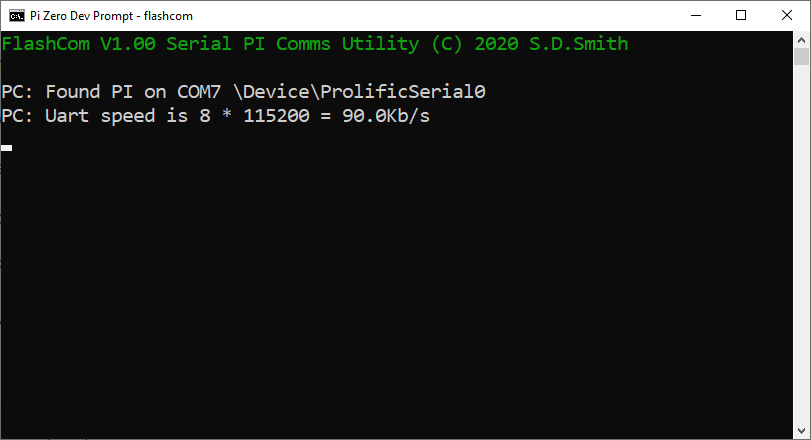
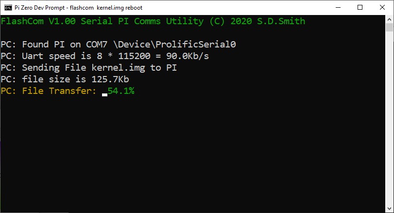
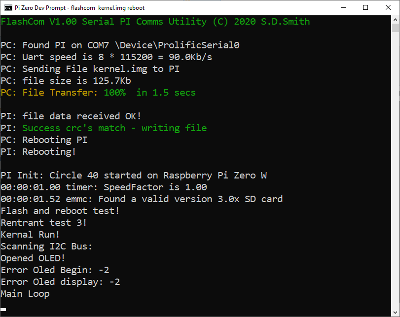

# PiZero-FlashCom

This is a windows command line system:

Simple USB-Uart flash com server, sits ontop of the awesome Circle Bare metal lib (https://github.com/rsta2/circle)

Flashcom runs entirely inside the serial device interrupt system - no special code needed.

Two Parts:


1) FlashCom.c - a PC side console program

```
type Flashcom.bat to make flashcom.exe
```

Running Flashcom.exe will display any debug info from the logger (if contructed with a CSerial device)

It can also upload files to the PI and reboot the PI if needed.

The Uart speed is currently fixed to 11520x8bps

Com port is auto detected



typing "FlashCom Kernel.img reboot"

will connect to PI - upload kernel.img - write to sdcard and reboot the PI :)





2) How to use:

You need to put serial.h in circle-master/include/circle and serial.cpp into circle-master/lib. The flashcom server will then be available to all your projects.

Then you just need to create Logger with serial device
```
if (bOK)
		{
		CDevice *pTarget = &m_Serial;
		bOK = log.Initialize(pTarget);
		}
```

make sure serial is set to 921600 speed. It's currently hardcoded in flashcom.c, maybe it's possible to auto detect the uart speed at a later commit. 
```
if (bOK)
		{
		bOK = m_Serial.Initialize(115200 * 8);
		}
```

and make sure you mount the fatfs somewhere in kernel.cpp
```
	FATFS *fs = (FATFS*)malloc(sizeof(FATFS)); 
	f_mount(fs, "", 0);
```


  
  Modify rules.mk in circle-master/
  
  to
  ```
  flash: $(TARGET).img
	flashcom $(TARGET).img reboot
```	
  
  
  "make flash" will now build your kernel, then upload to PI and reboot PI - too easy!

  
  To Do:
  ```
  Add compression - deflate,inflate to get the transfer times lower.
  
  Windowed output on the pc using #winname# tag or something similar!
  ```
